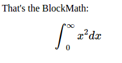

# react-katex

[](https://travis-ci.org/talyssonoc/react-katex) [](https://codeclimate.com/github/talyssonoc/react-katex) [](https://coveralls.io/github/talyssonoc/react-katex?branch=master)

> Display math expressions with [KaTeX](https://khan.github.io/KaTeX/) and React

## Installation

```sh
  $ npm install react-katex
```

## Usage

`react-katex` has two types of math components, `InlineMath` and `BlockMath`.

### InlineMath

Display math in the middle of the text.

```jsx
  var InlineMath = ReactKaTeX.InlineMath;

  ReactDOM.render(<InlineMath math="\\int_0^\\infty x^2 dx"/>,
                document.getElementById('math'));

  // or

  ReactDOM.render(<InlineMath>\int_0^\infty x^2 dx</InlineMath>,
                document.getElementById('math'));
```

It will be rendered like this:


### BlockMath

Display math in a separated block, with larger font and symbols.

```jsx
  var BlockMath = ReactKaTeX.BlockMath;

  ReactDOM.render(<BlockMath math="\\int_0^\\infty x^2 dx"/>,
                document.getElementById('math'));

  // or

  ReactDOM.render(<BlockMath>\int_0^\infty x^2 dx</BlockMath>,
                document.getElementById('math'));
```

It will be rendered like this:




**Note:**<br>
Don't forget to import KaTeX CSS file.
```jsx
import 'katex/dist/katex.min.css';
```

### Error handling

#### Default error message

By default the error rendering is handled by KaTeX. You can optionally pass `errorColor` (defaults to `#cc0000`) as a prop:

```jsx
var BlockMath = ReactKaTeX.BlockMath;

ReactDOM.render(
  <BlockMath
    math={'\\int_0^\\infty x^2 dx \\inta'}
    errorColor={'#cc0000'}
  />, document.getElementById('math'));
```

This will be rendered like so:


#### Custom error message

It's possible to handle parse errors using the prop `renderError`. This prop must be a function that receives the error object and returns what should be rendered when parsing fails:

```jsx
var BlockMath = ReactKaTeX.BlockMath;
  
ReactDOM.render(
  <BlockMath
    math="\\int_{"
    renderError={(error) => {
      return <b>Fail: {error.name}</b>
    }}
  />,
  document.getElementById('math'));

// The code above will render '<b>Fail: ParseError</b>' because it's the value returned from `renderError`.
```

This will render `<b>Fail: ParseError</b>`:


### Escaping expressions

In addition to using the `math` property, you can also quote as a child allowing the use of `{ }` in your expression.

```jsx
ReactDOM.render(<BlockMath>{"\\frac{\\text{m}}{\\text{s}^2}"}</BlockMath>,
                document.getElementById('math'));
```

Or Multiline

```jsx
ReactDOM.render(<BlockMath>{`\\frac{\\text{m}}
{\\text{s}^2}`}</BlockMath>,
                document.getElementById('math'));
```

However, it can be annoying to escape backslashes. This can be circumvented with the `String.raw` tag on a template literal when using ES6.

```jsx
ReactDOM.render(<BlockMath>{String.raw`\frac{\text{m}}{\text{s}^2}`}</BlockMath>,
                document.getElementById('math'));
```

Backticks must be escaped with a backslash but would be passed to KaTeX as \\\`. A tag can be created to replace \\\` with \`

```jsx
const latex = (...a) => String.raw(...a).replace("\\`","`")
ReactDOM.render(<BlockMath>{latex`\``}</BlockMath>,
                document.getElementById('math'));
```

You can even do variable substitution

```jsx
const top = "m";
const bottom = "s";
ReactDOM.render(<BlockMath>{String.raw`\frac{\text{${top}}}{\text{${bottom}}^2}`}</BlockMath>,
                document.getElementById('math'));
```
